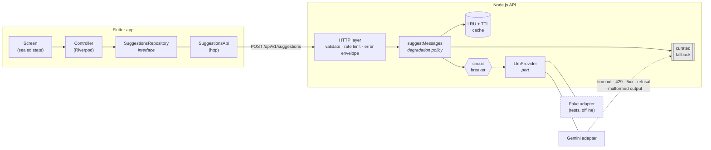

# AI Gift Card Message Suggester

Senior full stack technical test — a Node.js/TypeScript API that generates gift
card messages with an LLM, and a Flutter app that consumes it.

The interesting part of this problem is not the API call. It is what happens when
the model is slow, rate-limited, down, refusing, or answering with something that
is not what we asked for — and what the person buying a gift card sees in each of
those cases. That is where most of the design effort here went.

**Original brief:** [smash-gift/fullstack-dev-test](https://github.com/smash-gift/fullstack-dev-test)

---

## Where this fits

Smash sells digital gift cards. When someone buys one as a present, there is a
field for the note that travels with it — and staring at an empty box is the
moment this feature exists for.

So the screen here is a standalone demo of a step that would live inside
checkout: the buyer has already chosen the brand and the value, and now has to
write something. That framing drove two decisions worth naming:

- **The messages never mention the gift, its value, or the brand.** They sit
  right next to all of that on the delivered card; repeating it reads as filler.
  The prompt says so explicitly.
- **No greeting header, no signature, no `[Name]` placeholder.** The note is one
  field in a larger layout, not a letter.

The brief specifies `occasion` and `relationship` as the inputs, and that is what
the API takes. A real integration would know more — the brand, the amount, the
recipient's name — and those would make the suggestions better; see
[What I would do next](#what-i-would-do-next).

---

## Contents

- [Where this fits](#where-this-fits)
- [Quick start](#quick-start)
- [Architecture](#architecture)
- [API](#api)
- [Failure handling and the fallback](#failure-handling-and-the-fallback)
- [Cost and caching](#cost-and-caching)
- [Rate limiting](#rate-limiting)
- [Security](#security)
- [Tests](#tests)
- [Trade-offs at a glance](#trade-offs-at-a-glance)
- [What I would do next](#what-i-would-do-next)
- [Use of AI assistance](#use-of-ai-assistance)

---

## Quick start

**Requirements:** Node.js 20+, Flutter 3.38+ (developed on 3.47.2 / Dart 3.13.2).

### 1. Backend

```bash
cd backend
npm install
```

**Create your `.env` from the template.** There is no `.env` in the repository —
it holds a credential, so it is gitignored. `.env.example` is the committed
template, documents every setting, and is the file to copy:

```bash
cp .env.example .env        # Windows: copy .env.example .env
```

Then open `.env` and set your Google AI key:

```ini
LLM_PROVIDER=gemini
GEMINI_API_KEY=your-key-here     # https://aistudio.google.com/apikey
```

The server validates its configuration at boot and refuses to start without a key
when `LLM_PROVIDER=gemini`, naming the variable it is missing — a container that
cannot work should never report healthy.

```bash
npm run dev
```

> **A note on the Gemini free tier.** Its latency swings hard: the same prompt
> answered in 1.4s and in 24s within the same hour of testing, and under load it
> returns `503 UNAVAILABLE` outright. That is the provider, not this project —
> and it is precisely the condition the fallback exists for, so a slow afternoon
> shows you the degraded path rather than a broken one. If you want the
> personalised suggestions and the tier is having a bad moment, see
> [If requests time out](#if-requests-time-out-or-always-show-the-standard-messages-notice).

The API is on **http://localhost:8080**. Check it:

```bash
curl -s -X POST http://localhost:8080/api/v1/suggestions \
  -H 'Content-Type: application/json' \
  -d '{"occasion":"Birthday","relationship":"Friend"}'
```

#### No API key? Run the whole thing anyway

Set this in the same `.env` and leave `GEMINI_API_KEY` empty:

```ini
LLM_PROVIDER=fake
```

A deterministic in-process provider: no network, no key, no cost. It exists
because the failure paths have to be reproducible — the tests drive it to raise
each kind of provider failure on demand, and CI runs the whole suite with no
secret configured at all. As a side effect it lets a reviewer see the entire flow
working before deciding whether to spend a token on it. The suggestions it
returns are obviously synthetic; nobody will mistake them for generated text.

### 2. Flutter app

```bash
cd flutter_app
flutter pub get
```

#### On the web

```bash
flutter run -d chrome
```

#### On Android

Start an emulator or plug in a device, then:

```bash
flutter run -d android
```

**No flags needed for either.** `API_BASE_URL` defaults to a local backend and
knows where that is per platform: an Android emulator runs behind its own NAT,
so `localhost` there is the emulated device and the host machine is
`10.0.2.2`. Getting that wrong looks exactly like a backend that is down, so the
app resolves it rather than asking you to.

#### From Android Studio or VS Code

Open `flutter_app/` as the project, pick your device, press **Run**. There is
nothing to configure — the platform-aware default above is what makes that true.

**Web and Android run the same code.** There are no `_web.dart` / `_android.dart`
variants, no `dart:io`, no `dart:html`: the screen, the state machine, the
repository and the HTTP client are one set of files. The only platform branch in
the whole app is the two lines above that decide where a *local* backend lives —
so a change to a widget or to the failure handling shows up identically in both,
and the widget tests cover both because there is only one thing to cover.

Android Studio needs the Flutter and Dart plugins (*Settings → Plugins*). If the
project shows no Flutter run configuration, *File → Invalidate Caches → Restart*
usually fixes it.

#### Pointing somewhere else

`--dart-define` overrides the default, for a deployed backend or a physical
device on your LAN:

```bash
flutter run --dart-define=API_BASE_URL=http://192.168.1.20:8080
```

| Target | What the default resolves to |
| --- | --- |
| Chrome / web | `http://localhost:8080` |
| Android emulator | `http://10.0.2.2:8080` |
| iOS simulator | `http://localhost:8080` |
| Physical device | Override it — the phone cannot see your machine's loopback |

For a physical device you also need its origin in `CORS_ORIGINS` in `.env`, or
leave that as `*` for local development.

Then enter **Birthday** and **Friend** and press *Get suggestions*.

#### What Android needed, and why it is already there

- **Cleartext HTTP for local addresses only.** Android has blocked plaintext
  HTTP since API 28, so `http://10.0.2.2:8080` would otherwise fail at the socket
  and surface as "could not reach the server" — a platform policy wearing the
  costume of a network error.
  `android/app/src/debug/res/xml/network_security_config.xml` permits it for
  `10.0.2.2`, `localhost` and `127.0.0.1` and nothing else, and it lives under
  `src/debug/` so release builds keep the strict default.
- **`INTERNET` permission** in the release manifest. Flutter adds it to debug
  builds automatically, which is exactly why forgetting it is a bug you only meet
  after shipping.

**Verified on:** Chrome (web) and an **Android 36 emulator** — debug APK built,
installed, and generating against the live Gemini API through `10.0.2.2`, with
the server log confirming `source: "llm"` for the request the phone made. The
cleartext config above is tested, not assumed.

**Not run on:** iOS. `ios/` is configured but building it needs macOS, which I do
not have. The app code is platform-agnostic (`http`, no `dart:io`), so the risk
there is in the configuration rather than the logic — but that is a reason to
believe it works, not evidence that it does.

#### If requests time out or always show the "standard messages" notice

The provider is slower than the request budget rather than broken — the Gemini
free tier does this under load, answering in 20-30s or returning `503`.

**Raise the server budget.** The app's own deadline is already 60s, chosen to
clear every budget suggested here, so the server stays the binding constraint and
you do not have to touch the client.

That ordering is deliberate. The server always answers inside its budget — with
suggestions or with the fallback — so a client deadline firing first discards an
answer that exists. An earlier build had the client at 20s against a 45s server
budget, and a request that generated real suggestions in 24s was shown to the
user as *"The request took too long"*: a success reported as a failure. The
default is now the wrong end to shorten.

```ini
# backend/.env
LLM_TIMEOUT_MS=30000
LLM_TOTAL_BUDGET_MS=45000
```

If you push `LLM_TOTAL_BUDGET_MS` past 60s, raise the client with it:

```bash
flutter run --dart-define=REQUEST_TIMEOUT_SECONDS=90
```

The invariant is `REQUEST_TIMEOUT_SECONDS` > `LLM_TOTAL_BUDGET_MS`, and a test
pins it.

Those are demo numbers, not shipping ones: the defaults assume a provider that
answers in 1-2s, which is what a paid tier does, and nobody buying a gift card
waits 45 seconds for a greeting.

### 3. See the fallback

The behaviour worth demonstrating. With the backend running:

```bash
# In backend/.env, break the key on purpose:
GEMINI_API_KEY=definitely-not-a-valid-key
```

Restart and ask again. The API answers **HTTP 200** with curated messages and
`meta.degraded: true`, and the app shows them under a notice saying they are the
standard ones. Nothing errors, and no stack trace reaches the client.

### 4. Running the checks

```bash
cd backend     && npm run lint && npm run typecheck && npm test && npm run build
cd flutter_app && flutter analyze && flutter test
```

`.github/workflows/ci.yml` runs the same gates, plus both builds.

---

## Architecture

Two deployable units and a documented contract between them.



### Backend layering

```
adapters/inbound/http  →  application  →  domain
                              ↑
        adapters/outbound ────┘   (implements application/ports)

shared/  — dependency-free helpers, importable by any layer, importing none
```

Both halves of `adapters/` are adapters in the same sense; the split names the
direction. Inbound drives the application (HTTP); outbound is driven by it
(Gemini, cache, catalogue, logging). There is no `infrastructure/` — having one
folder for driving adapters and another for driven ones named something else was
a distinction without a difference.

`domain/` knows nothing about HTTP, Express, Zod or any provider. `application/`
depends on ports (`LlmProvider`, `Cache`, `SuggestionCatalogue`, `Logger`), never on
a concrete adapter. `bootstrap.ts` is the only file that names both a port and an
implementation.

**These rules are enforced by `no-restricted-imports`, not by this paragraph.**
They were violated once before they were a rule — the use case imported the
fallback table and the prompt version straight out of `infrastructure/` — which is
exactly why they are now a lint error.

```
backend/src/
├── domain/                errors · entities · text normalisation
├── application/
│   ├── ports/             LlmProvider · Cache · SuggestionCatalogue · Logger
│   ├── resilience/        timeout · retry · circuit breaker
│   └── suggestMessages    the degradation policy, in one place
├── adapters/
│   ├── inbound/http/      server · middleware · routes · validation
│   └── outbound/
│       ├── llm/           Gemini · Fake · prompt · parser
│       ├── cache/         in-memory LRU + TTL
│       ├── catalogue/     occasion registry · curated messages · pickers
│       └── logging/       structured logging
├── shared/                dependency-free helpers
└── bootstrap.ts           composition root
```

`adapters/outbound/catalogue/occasionRegistry.ts` is the **single source of truth
for occasions**: one entry carries the label the picker shows, the spellings that
resolve to it, and its curated messages. The lookup index is built from that
label, so a value the picker offers is one the fallback resolves — by construction
rather than by a test watching two lists stay in step, which is what it was before.

```
flutter_app/lib/
├── core/
│   ├── config/          build-time configuration (--dart-define)
│   └── network/         the failure hierarchy · correlation ids
└── features/suggestions/
    ├── domain/          entities + the repository interface
    ├── data/            the only file that knows the API exists
    └── presentation/    sealed state · controller · screen · widgets
```

The app mirrors the same idea, for the same reason: both sides face an unreliable
dependency across a boundary, and both put an interface at that boundary so a
fake can stand in for it. `SuggestionsRepository` plays exactly the role
`LlmProvider` plays on the server — it is what makes every screen state, including
each failure, reachable in a widget test without a server.

### Deployment

`backend/functions/` is a Cloud Functions v2 adapter. A v2 HTTPS function accepts
an Express app directly, so it is about twenty lines over the same handler the
tests exercise. It is a **separate npm package on purpose**: a service should not
depend on the SDK of its deployment target, and installing `firebase-functions`
into the API pulls in the whole `firebase-admin` tree — code the running service
never touches, carrying advisories it has no reason to carry. This way
`cd backend && npm audit` reports zero vulnerabilities and anyone who only wants
to run the API never installs any of it.

It compiles and has been reviewed, but it has **not been deployed** — there is no
Firebase project behind this exercise. Treat it as a reviewed deploy path, not a
verified one.

---

## API

Full specification: [`backend/openapi.yaml`](backend/openapi.yaml).

### `POST /api/v1/suggestions`

```jsonc
// request
{
  "occasion": "Birthday",      // required, 2-50 chars
  "relationship": "Friend",    // required, 2-50 chars
  "tone": "warm",              // optional: warm | funny | formal | heartfelt
  "count": 3                   // optional: 2-3
}
```

```jsonc
// 200
{
  "suggestions": [
    { "id": "s_1", "text": "Wishing you the happiest of birthdays." },
    { "id": "s_2", "text": "Hope your day is every bit as good as you are." }
  ],
  "meta": {
    "source": "llm",           // llm | cache | fallback
    "degraded": false,         // true whenever the LLM could not serve this
    "model": "gemini-flash-lite-latest",
    "requestId": "4f1c8a2e-...",
    "latencyMs": 842
  }
}
```

Every error uses one envelope:

```jsonc
{
  "error": {
    "code": "VALIDATION_ERROR",   // stable; branch on this, never on `message`
    "message": "The request could not be processed.",
    "requestId": "4f1c8a2e-...",
    "details": [
      {
        "field": "occasion",
        "rule": "too_short",      // machine-readable; the client words its own copy
        "message": "occasion must be at least 2 characters."
      }
    ]
  }
}
```

`message` is written for a developer reading a log; it may change. A client
branches on `code` and `rule` and words its own copy — which is exactly what the
Flutter app does.

| Code | Status | When |
| --- | --- | --- |
| `VALIDATION_ERROR` | 400 | Input rejected. Never reaches the model, never degrades to the fallback |
| `PAYLOAD_TOO_LARGE` | 413 | Body over 8 KB |
| `RATE_LIMITED` | 429 | Per-IP limit exceeded |
| `NOT_FOUND` | 404 | Unknown endpoint |
| `INTERNAL_ERROR` | 500 | Unexpected. Body is deliberately generic; `requestId` locates the real error in the logs |

Also: `GET /api/v1/options` (vocabulary for the app's pickers), `GET /health`
(liveness), `GET /ready` (readiness plus circuit breaker state).

### Why POST and not GET

GET was tempting. The call is read-only and idempotent, and it would be cacheable
by any HTTP cache all the way out to a CDN — a real cost saving for free.

It loses on where the inputs end up. `occasion` and `relationship` are
user-authored free text; in a query string they land in access logs, proxy logs,
browser history and `Referer` headers, in a way a request body does not.
Server-side caching recovers most of the cost benefit without that exposure.

---

## Failure handling and the fallback

### What counts as a failure

Two hierarchies, deliberately kept apart. `AppError` is the only thing whose
message a client ever sees; `LlmError` is an internal classification that decides
whether we retry, whether the breaker trips, and at what level we log. Keeping
them separate makes *"never expose raw errors"* a property of the type system
rather than a habit — to leak an internal detail, someone would have to
deliberately wrap it in an `AppError` first.

| Failure | Retried? | Why |
| --- | --- | --- |
| Timeout (8s per call) | Yes, 2× with jittered backoff | Transient |
| `429` quota | Yes, honouring `Retry-After` | Transient |
| `5xx` upstream | Yes | Transient |
| Network / DNS / TLS | Yes | Transient |
| `401` / `403` | **No** | A rejected key is a misconfiguration. Retrying multiplies the latency of a request that is already doomed. Logged at `error` for alerting |
| Content filter refusal | **No** | Deterministic. The same prompt will be refused again |
| Malformed output | One corrective retry, in the adapter | Restating the format requirement is cheap and usually works. Not the same as a transport retry, so it is not handled by the backoff loop |

Backoff uses **full jitter** (`random(0, exponential)`) rather than plain
exponential. When a provider degrades, every instance fails at the same moment;
deterministic backoff makes them all retry at the same moment too, which is the
thundering herd that keeps a recovering upstream down.

### The circuit breaker

Retries alone make an outage *worse*. Without a breaker, every request during an
outage burns the full retry budget — the user waits ~25 seconds for a fallback
that was available in 5 milliseconds, while we keep hammering an upstream that is
trying to recover and paying for attempts that cannot succeed.

Five consecutive failures open the circuit for 30 seconds. While open, requests
skip the provider entirely. After the window, one probe is admitted: service
resumes on its own if it succeeds, and the breaker re-opens if it does not.

`/ready` stays `200` while the circuit is open. A degraded instance still answers
every request correctly; pulling it from the pool would only concentrate the same
provider outage onto fewer instances. The state is *reported* so monitoring can
alert on it without the load balancer acting on it.

### There is also a deadline for the whole request

Per-call timeouts are not enough. With an 8-second timeout and two retries, the
worst case is about **26 seconds** of spinner before the user gets a fallback —
technically correct, and a bad experience. `LLM_TOTAL_BUDGET_MS` (12s) bounds what
the *caller* experiences: a later attempt gets whatever is left of the budget, and
a retry that could not finish in time is not started at all.

This one only became obvious when writing the client and asking what its timeout
should be.

### The fallback: HTTP 200, not 503

**The decision.** When the LLM cannot serve a request, the API returns `200` with
hand-written messages and `meta: { source: "fallback", degraded: true }`.

**Why.** The caller asked for gift card messages and receives gift card messages
that are safe to print. That a human wrote them instead of a model is a quality
difference, not a failed request. Someone in the middle of buying a gift should
not be blocked because a provider is having a bad afternoon. Signalling the
degradation in the body keeps the primary flow working while still letting the UI
be honest — the app shows a notice, and the user can try again for personalised
ideas.

**The cost, stated plainly.** A client that ignores `meta` cannot tell the two
apart, and monitoring that only watches status codes will not see the outage. I
accept that because the alternative pushes a fallback implementation into every
client, and because the outage *is* visible where it matters: `meta.source`, the
breaker state on `/ready`, and a `warn` log line per degraded request.

**What does not degrade.** Invalid input gets a `400` and never reaches the
provider. Answering it with generic messages would hide a client bug behind a
plausible-looking success.

**The fallback content** is a curated table over 14 occasions, with relationships
bucketed by register — you do not write to a manager the way you write to a
partner. Lookup walks `(occasion, register) → (occasion, default) → universal`, so
an unknown occasion degrades in specificity rather than failing. Every message is
hand-written, so no generation failure or injected instruction can reach a card
through this path, and the fallback itself can never be the thing that breaks.

---

## Cost and caching

### Implemented here

An in-process **LRU + TTL cache**, keyed by prompt version, model, tone, and the
case-normalised occasion and relationship — so `Birthday` and `birthday` share
one entry.

This works unusually well for this particular feature: the input space is tiny and
extremely repetitive. A handful of occasions crossed with a handful of
relationships covers most real traffic, and every hit is a generation not paid for.

Two details that matter:

- **The prompt version is part of the key.** Messages generated under different
  instructions are a different product and must not be served from an old entry.
- **The fallback is never cached.** Caching a degraded answer would stretch one
  provider blip into an hour of generic suggestions for that combination.

Caching trades away variety — everyone asking for `birthday + friend` inside the
TTL would see the same messages. Mitigated by caching everything the model
returned and serving a random subset of it.

### What is wrong with it

It is per-process. With *n* instances the hit rate falls roughly as 1/*n*, and
every deploy empties it. It is here because it costs no infrastructure and
demonstrates the decision; the `Cache` port exists so that Redis or a Firestore
collection is a change in `bootstrap.ts` and nowhere else.

### In production

| Lever | Effect |
| --- | --- |
| **Pre-compute the popular combinations** offline and serve them from Firestore | The biggest win by far. The LLM becomes the long-tail path, and the common case costs a document read |
| Shared cache (Redis / Firestore) | Fixes the per-instance hit rate and survives deploys |
| `maxOutputTokens: 512` — already set | The single most effective per-request lever, and it bounds the damage if the model starts rambling |
| No billed reasoning for a task that needs none | A reasoning model spends tokens thinking before it writes; three short greetings do not warrant it |
| A small, fast model — already `gemini-flash-lite-latest` | Order-of-magnitude cheaper than a frontier model for a task this constrained, and it does no billed reasoning |
| Per-user quotas behind auth | Stops one client from being the whole bill |
| Semantic caching by embedding | Catches `bday` / `birthday party` / `40th birthday` as one entry |
| A `$/request` metric with budget alerts | The thing that actually catches a cost regression |

---

## Rate limiting

**Implemented.** Per-IP fixed window, **20 requests per minute**, on the
generation endpoint only. Health checks are exempt — a probe must not be throttled
by whatever traffic shares its address. Rejections use the standard error envelope
with `RATE_LIMITED`, and draft-8 `RateLimit` headers let a well-behaved client back
off before it is rejected rather than discovering the limit by hitting it.

**Why it is there.** An unauthenticated endpoint that spends money on every call is
the one thing here that must not be left open. A trivial loop costs real tokens,
and a client with a retry bug does the same by accident.

**What it does not do.** It is a cost ceiling, not a security boundary — an
attacker with a pool of addresses walks around it. The real boundary is
authentication: a Firebase Auth uid with a per-user quota, plus App Check to tie
the endpoint to our own clients. Out of scope here, but it is the same middleware
slot.

`TRUST_PROXY` exists because the limit is only as trustworthy as the client IP.
Trusting `X-Forwarded-For` blindly would let anyone forge their way past it, so it
defaults to `0` (ignore the header) and must be set to the real number of proxy
hops in a deployment.

---

## Security

### The API key never leaves the server

This is the main reason the backend exists. The Flutter app has no key, no
provider SDK and no knowledge that Gemini is involved. `.env` is gitignored,
`.env.example` is the template, and the logger redacts credential-shaped fields so
a provider error that happens to echo a header cannot leak the key into a log
aggregator and outlive the incident.

### Prompt injection, in three layers

`occasion` and `relationship` are attacker-controlled text that ends up next to a
model instruction. No single defence holds, so there are three:

1. **Input.** NFKC normalisation (so fullwidth and lookalike codepoints fold onto
   ASCII *before* the other filters run), control and zero-width characters
   stripped, whitespace collapsed, 50-character cap, character allowlist. This
   removes the cheap tricks — invisible text, fake role markers smuggled through
   newlines.
2. **Structure.** The instructions live entirely in the system role. The user
   values travel as a **JSON document in the user turn** and are never
   concatenated into the sentence carrying the instructions, so a hostile value
   arrives as the contents of a string field rather than as a line of the prompt.
3. **Output.** Every generated message is re-validated: schema, length bounds, no
   URLs, no markdown, no duplicates. A message that was successfully steered
   off-task still has to survive this to reach a client.

Layer 3 is the one that actually holds, which is why it exists even though
constrained decoding makes malformed replies rare.

### Everything else

- **Strict input validation** (Zod), with unknown keys **rejected** rather than
  ignored — an unrecognised field is either a client bug worth surfacing or an
  attempt to smuggle something past us.
- **8 KB body limit.** The largest legitimate request is a few hundred bytes.
- **`helmet`** security headers; `x-powered-by` disabled.
- **CORS allowlist** via `CORS_ORIGINS` (`*` for local development only).
- **Timeouts on every outbound call**, plus an overall request deadline.
- **A client disconnect aborts the provider call** — nobody is left to read the
  answer, so we stop paying for it.
- **No user input in logs by default.** The request id is enough to correlate a
  report with a log line; logging user-supplied strings by reflex is how PII ends
  up in log storage.
- **`npm audit`: zero vulnerabilities** in the backend.

### Not implemented, and it would be first in production

Authentication. An open LLM proxy is a money-burning endpoint. Firebase Auth ID
token verification plus App Check, with per-uid quotas, is the real fix; the rate
limiter is a stopgap.

---

## Tests

```
backend      122 tests   ~95% line coverage   (vitest + supertest)
flutter_app   39 tests                        (flutter_test)
```


**The provider is faked, not mocked.** Tests substitute `FakeLlmProvider` at the
composition root and run everything else for real — the actual middleware stack,
through supertest. The bugs worth catching in this codebase live in the wiring:
middleware order, what the error handler serialises, whether the fallback really
produces a 200. A test that mocks the layer it is testing cannot see any of them.

The one exception is `geminiProvider.test.ts`, which mocks the Google SDK — there
the mapping from provider outcomes onto our taxonomy *is* the logic under test.

Highlights:

- **The fallback path across all eight failure kinds**, asserting 200,
  `source: "fallback"`, 2–3 usable messages, and that no provider error string
  survives into the response.
- **The OpenAPI spec** documents the contract the app is written against. It is
  maintained by hand; with more than one client I would generate the Dart client
  from it, which turns drift from a discipline into an impossibility.
- Circuit breaker state transitions, retry classification per failure kind, and
  the overall deadline — all with injected clocks, so nothing waits on real time.
- Parser tolerance: code fences, surrounding prose, wrong shape, links, duplicates,
  over-long messages.
- Flutter: widget tests for idle, loading, success, **degraded**, and each failure
  kind, plus retry recovery and client-side validation blocking a call before it
  reaches the network.

---

## Trade-offs at a glance

The reasoning behind each of these, at full length, is in
[`docs/decisions.md`](docs/decisions.md).

| Decision | Rejected alternative | Why |
| --- | --- | --- |
| Fallback answers `200` | `503`, client decides | A usable degraded answer beats a broken flow; `meta` keeps it honest |
| POST | GET (CDN-cacheable) | Keeps user text out of URLs, logs and history |
| One real provider | Ship an OpenAI adapter too | An adapter written against docs and never run looks like working code and is not |
| In-process cache | Redis | No infrastructure cost for a test; the port makes swapping it trivial |
| Express primary, Functions adapter | Functions only | `npm run dev` and a `curl` is a better first five minutes than emulator setup |
| Functions as a separate package | Dependency of the backend | A service should not depend on its deployment target's SDK |
| Riverpod + sealed state | BLoC | Less boilerplate, exhaustive `switch` over states |
| TypeScript 5.9 | TypeScript 7 | `typescript-eslint` does not support 7 yet; type-aware linting is worth more here than being on the newest major |
| Per-IP rate limit | None, or auth | A cost ceiling now, honest about not being a security boundary |

---

## What I would do next

In priority order, if this were going further than a test:

1. **Authentication and per-user quotas** (Firebase Auth + App Check). Everything
   else is secondary to closing an open, metered endpoint.
2. **Shared cache and offline pre-computation** of popular combinations — the
   change that actually moves the cost curve.
3. **Real observability**: OpenTelemetry traces spanning app → API → provider,
   with `$/request`, degradation rate and breaker transitions as first-class
   metrics. The correlation id already starts in the app and survives into the
   server logs, so the plumbing is half there.
4. **Prompt evaluation.** There is no way to tell today whether a prompt change
   made the messages better. A small golden set plus an LLM-as-judge score,
   pinned to `PROMPT_VERSION`, would make prompt changes reviewable.
5. **Feed the purchase context into the prompt.** In checkout the system already
   knows the brand, the amount and often the recipient's name. "Happy birthday,
   enjoy dinner on me" is a better card than "Happy birthday" — and the prompt
   would need a matching rule about *still* not naming the value, which is the
   kind of thing worth testing before shipping.
6. **Generate the Dart client from `openapi.yaml`** once there is more than one
   endpoint or more than one client, turning drift from detected into impossible.
7. Deploy the Functions path for real, and verify it rather than reasoning about it.

---

## Use of AI assistance

I used **Claude Code (Claude Opus)** throughout this exercise, as an
implementation partner. Being specific about the split, since the brief asks:

**What I decided.** The choices that shaped the result were mine, and were made
explicitly before implementation started:

- Google Gemini Flash as the provider, behind a port with a fake for tests.
- Express as the primary server with Cloud Functions as a thin adapter, rather
  than making Firebase load-bearing — the brief names Firebase in its header but
  in none of its requirements.
- Riverpod with Dart 3 sealed state for the app.
- The fallback answering `200` with `meta.degraded`, rather than `503`.
- Establishing the consistency mechanisms (`CLAUDE.md`, `docs/decisions.md`,
  `openapi.yaml`) *before* the Flutter half was written, on
  the grounds that the backend↔client boundary is where a project starts looking
  like two different authors.
- Scope calls throughout: dropping the second provider adapter, isolating
  `firebase-functions` into its own package, keeping the test at the size the
  brief asks for rather than gold-plating it.

**What the assistant did.** Wrote the large majority of the code, tests and prose
in this repository, under review, and iterated on the parts I pushed back on.

**What that process caught** — worth listing, because it is the honest answer to
"was this reviewed or just generated":

- An empty `GEMINI_API_KEY=` in `.env.example` failed validation even with
  `LLM_PROVIDER=fake` — exactly what a reviewer copying the template would hit.
  Empty now means unset.
- `req.on('close')` also fires when a request body finishes being read, so the
  original client-disconnect handling would have aborted every call the moment
  the body parser finished. It watches `res` with `writableEnded` instead.
- Gemini's schema dialect is OpenAPI-flavoured: the type is an enum of upper-case
  names and the array bounds are strings. Guessing JSON Schema would have failed
  silently at runtime.
- The layering rule was violated by the code that stated it, which is why it is
  now a lint error rather than a paragraph.
- The 26-second worst case behind per-attempt timeouts, which produced
  `LLM_TOTAL_BUDGET_MS`.
- `gemini-flash-latest` now resolves to a model that reasons, and reasoning
  tokens are billed from the same `maxOutputTokens` budget as the answer. A
  32-token probe came back empty with every token spent on thoughts — a failure
  the adapter would have reported as unparseable output, which looks nothing
  like the cause. Default model changed to `gemini-flash-lite-latest`, which is
  the right size for three short greetings anyway.
- The first attempt to fix that sent `thinkingConfig` unconditionally, which the
  lite model rejects with `400 INVALID_ARGUMENT` — so the "fix" broke the
  configuration that had just worked. It is now opt-in, and the test asserts the
  field is *absent*, not merely undefined.
- Google returns a rejected API key as **400 `INVALID_ARGUMENT`**, not 401/403 —
  found by pointing the real adapter at the live API with a deliberately invalid
  key. The status-only classifier had filed the commonest production
  misconfiguration under `unknown` at `warn`, so the `error`-level alert it was
  designed for would never have fired. Fixed, with a regression test.

Everything in this repository has been read, and every command in this README was
run against the fake provider. Where something was *not* verified, this README
says so rather than implying otherwise — the Cloud Functions path was not
deployed, and the note below records the state of the live Gemini check.

> **Live provider check: done.** Both paths were run against the live Gemini API
> with a real key — successful generation, the cache, and the degraded path under
> a genuine upstream outage. Several of the findings above came out of that
> session. The Cloud Functions path remains compiled but not deployed, and this
> README says so where it matters.
